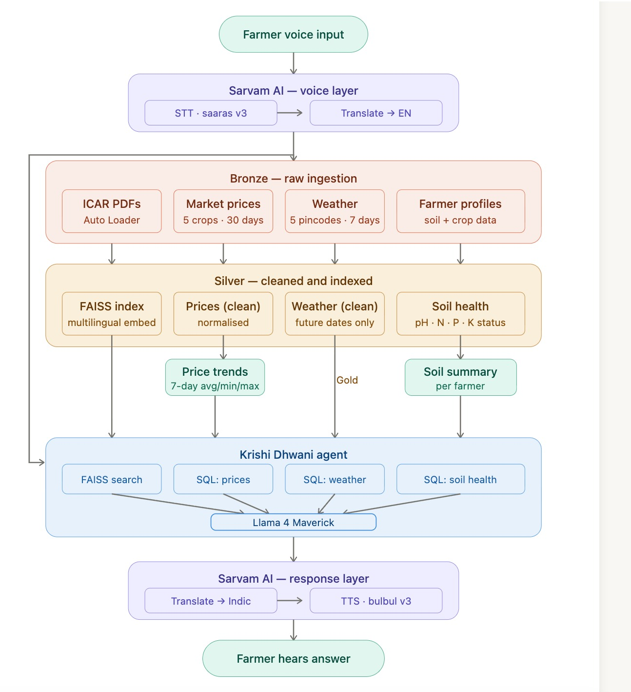

# Krishi Dhwani

What it does
------------
Krishi Dhwani is a voice-enabled agricultural advisory app that combines ICAR knowledge, live weather, and market prices with an LLM (Databricks Llama 4 Maverick) to give concise, actionable recommendations to farmers.

Architecture diagram
--------------------


How to run (exact commands)
---------------------------
1. Open a terminal in the repository root (where this README lives):

```bash
cd /home/aman/Downloads/krishi-dhwani
```

2. Create and activate a Python virtual environment:

```bash
python3 -m venv .venv
source .venv/bin/activate
```

3. Install the Python dependencies:

```bash
pip install -r krishi-dhwani/requirements.txt
```

4. Set required environment variables (replace the placeholders):

```bash
export SARVAM_API_KEY="<YOUR_SARVAM_API_KEY>"
export DATABRICKS_HOST="https://<your-databricks-workspace-url>"
export DATABRICKS_TOKEN="<YOUR_DATABRICKS_TOKEN>"
# Optional: change port
export DATABRICKS_APP_PORT=8000
```

Note: The app currently has some API keys embedded for convenience during development. For production, update `krishi-dhwani/app.py` to read keys only from environment variables.

5. Run the app (starts a local Gradio UI):

```bash
python krishi-dhwani/app.py
```

6. Open the UI in your browser:

- If running locally with default port: http://localhost:8000

Demo steps (what to click / what prompt to run)
----------------------------------------------
Voice Advisory (recorded WAV or mic)

1. Open the app in the browser.
2. Click the "🎤 Voice Advisory" tab.
3. Use the microphone or upload a WAV file in **Your Question**.
4. Select a farmer profile from the **Farmer Profile** dropdown (e.g., "F001 — Rajinder Singh (Punjab, Wheat)").
5. Choose a language (e.g., "Hindi").
6. Click the **🚀 Get Advisory** button.
7. After processing you will:
   - Hear the advisory via **🔊 Listen to Advisory**.
   - See the advisory text in **📝 Advisory Text**.

Try this example prompt (spoken or uploaded as WAV):

- "क्या मुझे इस हफ्ते सरसों बोनी चाहिए?"  (Hindi)
- or English: "Should I sow mustard this week?"

Chat (text)

1. Click the "💬 Chat" tab.
2. Select Farmer Profile and Language.
3. Type a question in the chat input (e.g., "How to improve wheat yield?") and press Enter or click **Send ➤**.
4. The bot replies in the selected language and stores the conversation in the chat area.

Notes & troubleshooting
-----------------------
- Databricks Connect and Databricks SDK clients require a valid workspace and token; follow Databricks docs to configure access.
- If you see errors loading the FAISS index, ensure the `FAISS_VOLUME_PATH` in `krishi-dhwani/app.py` points to a readable Databricks Filesystem path and the app has permission to download files.
- Replace any hard-coded API keys in `krishi-dhwani/app.py` with environment variables for security.

Files added/used
----------------
- `architecture.jpeg` — architecture diagram (already in repo)
- `krishi-dhwani/app.py` — main app entrypoint (Gradio UI)

Author
------
Krishi Dhwani team
